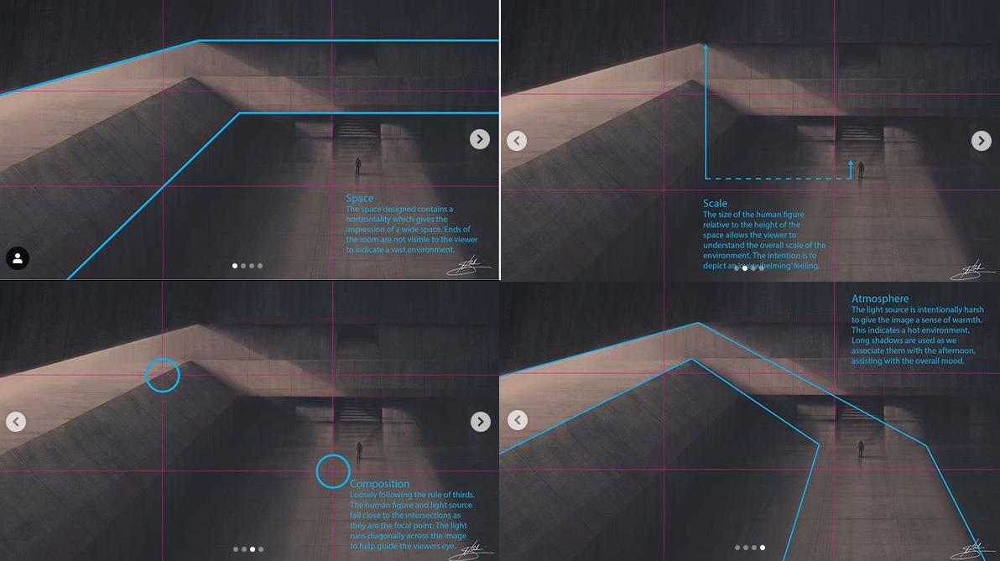
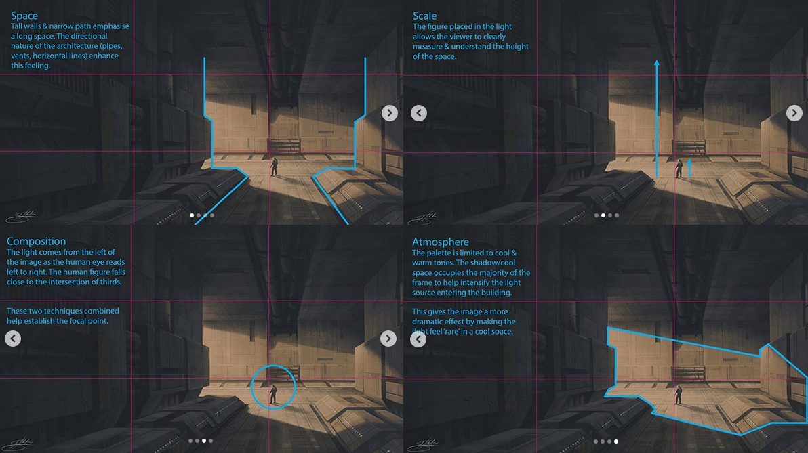
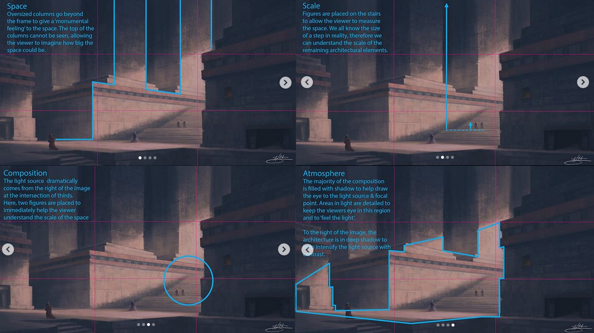
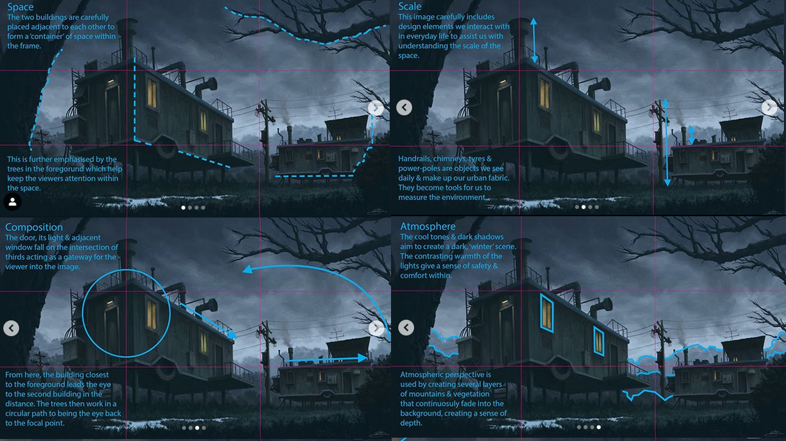
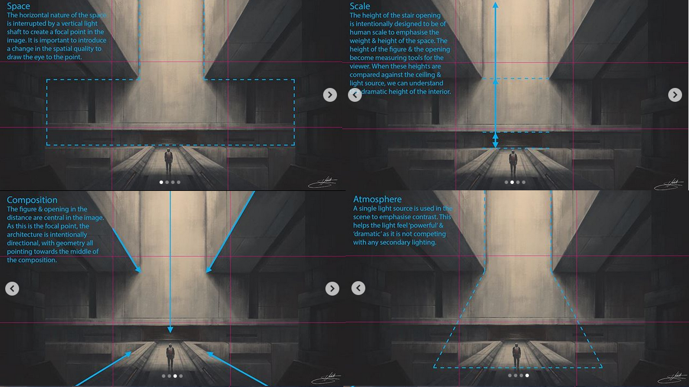

# Geology landforms
[Category:Slope landforms](https://en.wikipedia.org/wiki/Category:Slope_landforms)  
[Category:Topography](https://en.wikipedia.org/wiki/Category:Topography)  
[List of landforms](https://en.wikipedia.org/wiki/List_of_landforms)  
[Hoodoo (geology)](https://en.wikipedia.org/wiki/Hoodoo_(geology))  
[Flatiron (geomorphology)](https://en.wikipedia.org/wiki/Flatiron_(geomorphology))  and [Flatirons](https://en.wikipedia.org/wiki/Flatirons)  
[Hogback (geology)](https://en.wikipedia.org/wiki/Hogback_(geology))  
[Quarry](https://en.wikipedia.org/wiki/Quarry)  
[Escarpment](https://en.wikipedia.org/wiki/Escarpment)  
[Outcrop](https://en.wikipedia.org/wiki/Outcrop)  
[Savanna](https://en.wikipedia.org/wiki/Savanna)  
[Mountain pass](https://en.wikipedia.org/wiki/Mountain_pass)  
[Illustrated Glossary: Landforms and Bodies of Water](https://www.enchantedlearning.com/geography/landforms/glossary.shtml)  ((enchantedlearning.com))  
[ALPHABETICAL GLOSSARY OF GEOMORPHOLOGY](http://www.geomorph.org/wp-content/uploads/2015/06/GLOSSARY_OF_GEOMORPHOLOGY1.pdf)  ((geomorph.org))  

### Plants
[Banyan](https://en.wikipedia.org/wiki/Banyan)  

###Water
[Bight (geography)](https://en.wikipedia.org/wiki/Bight_(geography))  
[What is a Cape?](https://eschooltoday.com/landforms/what-is-a-cape-and-peninsula-landform.html)  
[List of isthmuses](https://en.wikipedia.org/wiki/List_of_isthmuses)  
[Isthmus](https://en.wikipedia.org/wiki/Isthmus)  
[Tombolo](https://en.wikipedia.org/wiki/Tombolo)  
[Ciénega](https://en.wikipedia.org/wiki/Ci%C3%A9nega)  
[Riprap](https://en.wikipedia.org/wiki/Riprap)  
[Riparian zone](https://en.wikipedia.org/wiki/Riparian_zone)  
[Spring (hydrology)](https://en.wikipedia.org/wiki/Spring_(hydrology))  

#### Other
[Map–territory relation](https://en.wikipedia.org/wiki/Map%E2%80%93territory_relation)  
[Wonders of the World](https://en.wikipedia.org/wiki/Wonders_of_the_World)  

# Composition breakdown
  
  
  
  
  
  
